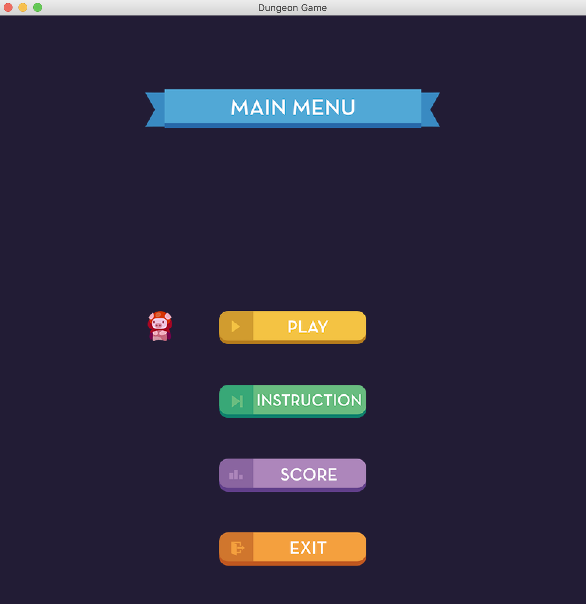
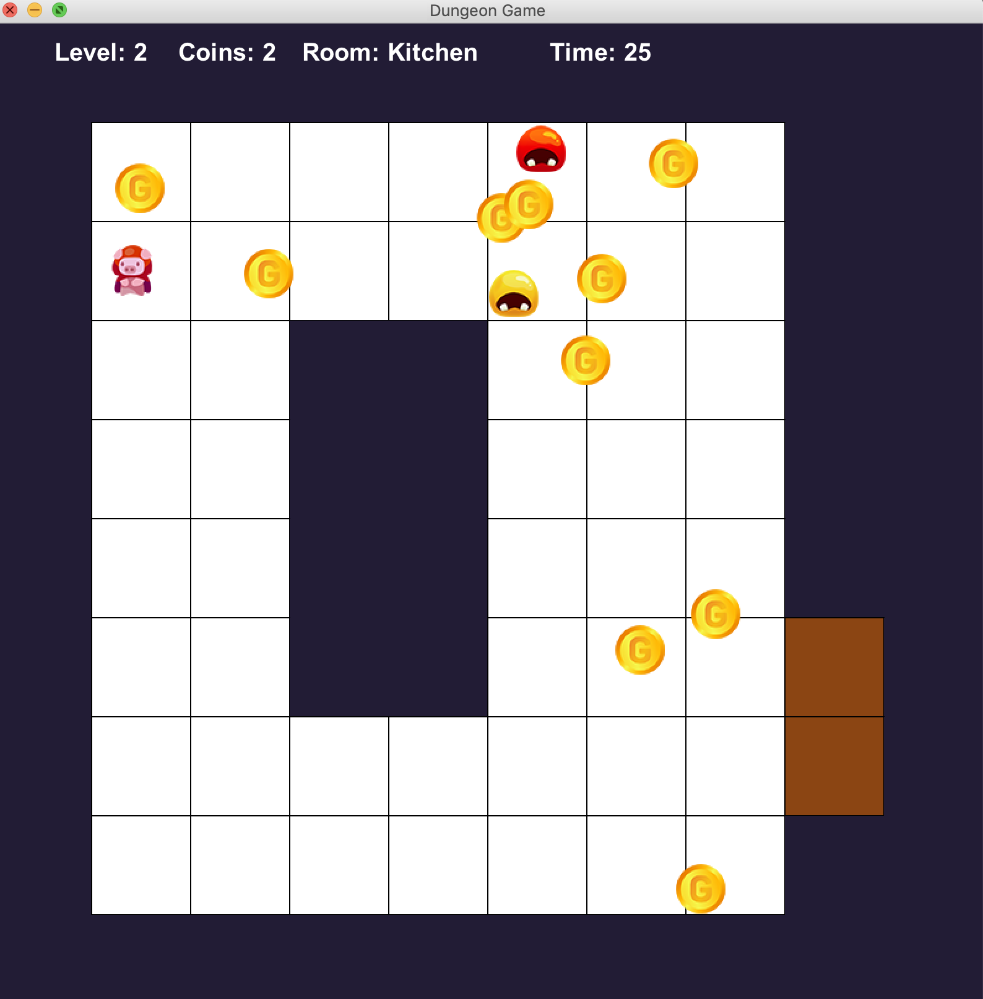
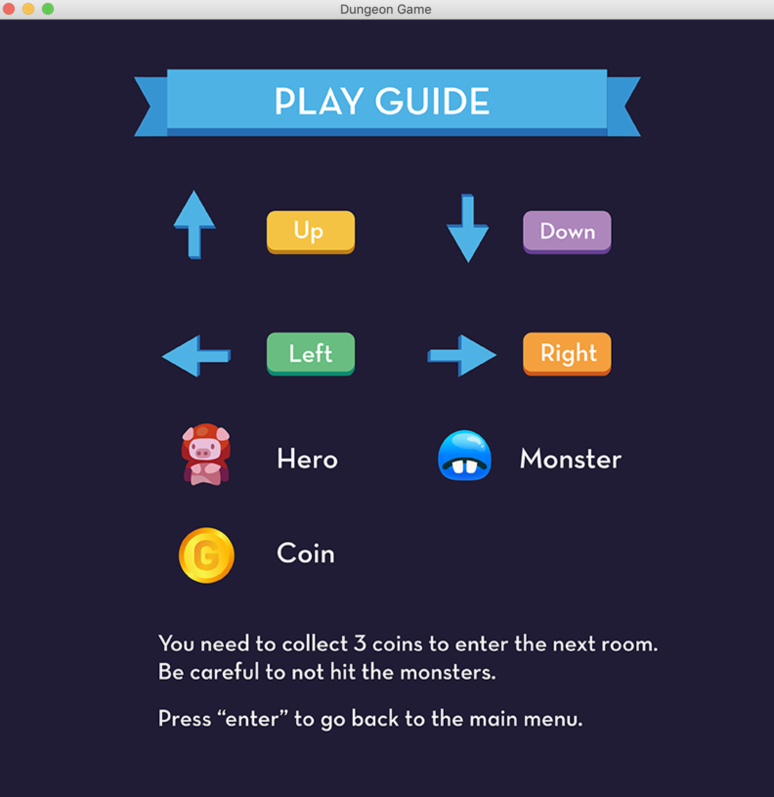
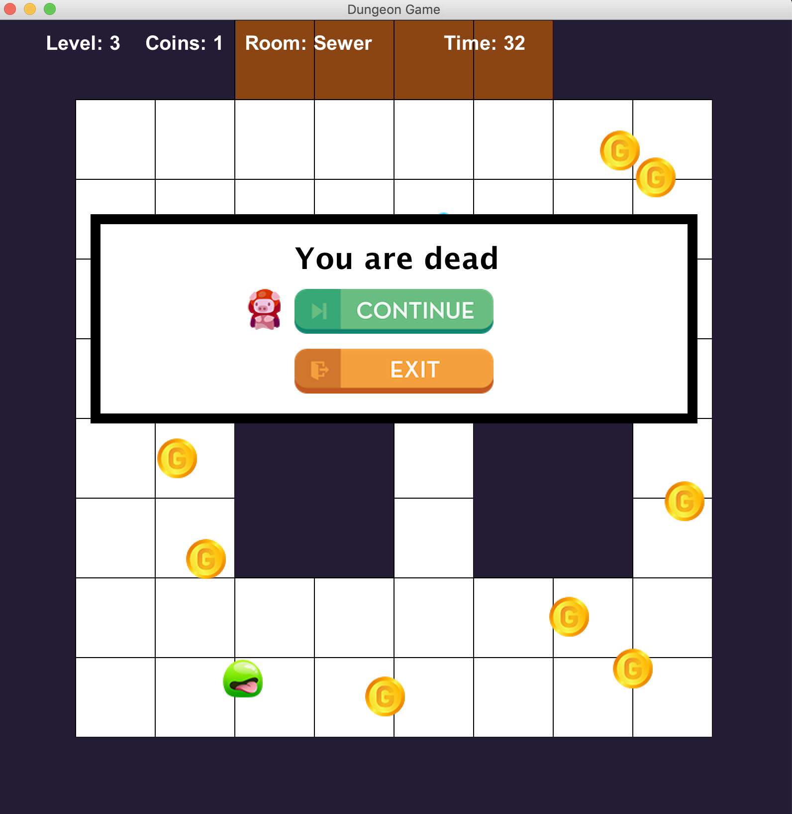

<a href="http://www.sebastianglahn.com"></a>


# Java Dungeon Game

As part of an MSc Project, I have built a dungeon game with Java. It serves very good as a game template for future projects.  


### Running the game

- Please clone this repository using `git clone https://github.com/storatus/java-dungeon-game.git` first.

- In your directory after cloning please do the following to run the game:

```shell
$ cd java-dungeon-game/src
$ javac Main
$ java Main
```

## Features

The hero must collect three coins in a level so he can go through the blue door. If you touch a monster you die and have to restart.


## Examples

<a href="http://www.sebastianglahn.com"></a>

<a href="http://www.sebastianglahn.com"></a>

<a href="http://www.sebastianglahn.com"></a>


## Support

Please visit my <a href="http://www.sebastianglahn.com" target="_blank"> website </a>. I am always open for new projects and freelance work.

## License

[](http://badges.mit-license.org)

- **[MIT license](http://opensource.org/licenses/mit-license.php)**
- Copyright 2018 © <a href="http://www.sebastianglahn.com" target="_blank"> Sebastian Glahn </a>.
